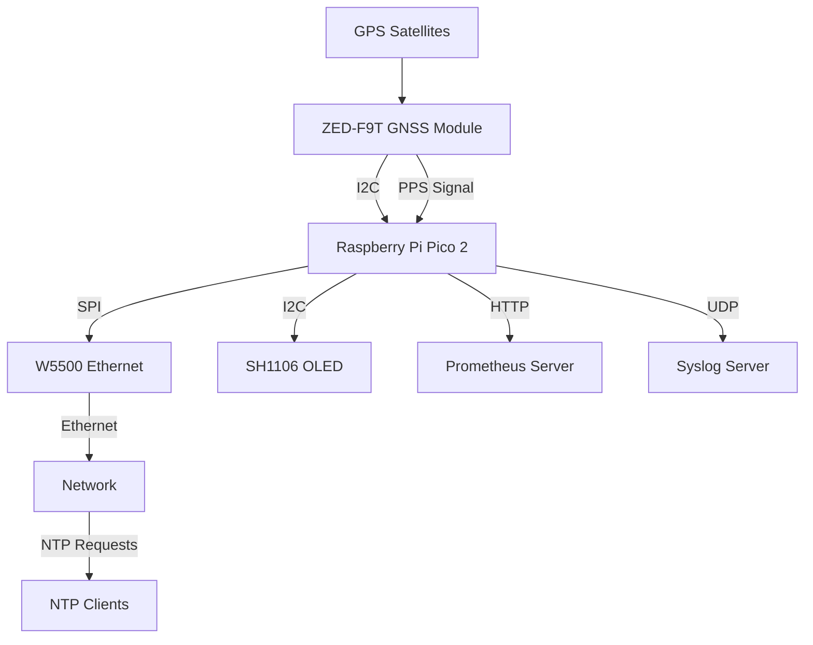
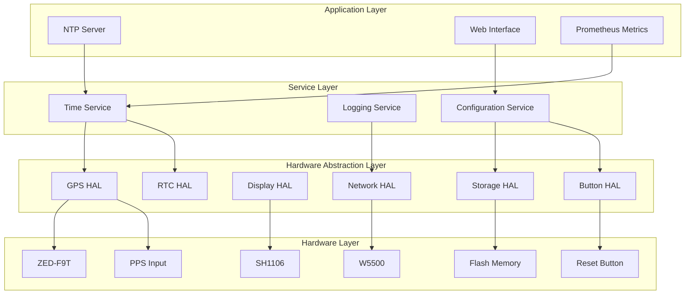

# GPS NTP Server Design Document

## Overview

このシステムは、Raspberry Pi Pico 2をベースとしたGPS同期NTPサーバーです。GPS受信機からのPPS（Pulse Per Second）信号を利用して高精度な時刻同期を実現し、イーサネット経由でNTPサービスを提供します。システムは以下の主要コンポーネントで構成されます：

- **Raspberry Pi Pico 2**: メインコントローラー（RP2350マイクロコントローラー）
- **SparkFun GNSS Timing Breakout ZED-F9T**: GPS/GNSS受信機とPPS信号生成
- **W5500**: イーサネット接続モジュール
- **SH1106 OLED**: 128x64ピクセルディスプレイ

## Architecture

### System Architecture



### Software Architecture



## Hardware Wiring Diagram

### Pin Connections

```
Raspberry Pi Pico 2 Pin Assignments:

GPIO Pins:
- GPIO 0 (I2C0 SDA)  → SH1106 SDA (OLED I2C bus)
- GPIO 1 (I2C0 SCL)  → SH1106 SCL (OLED I2C bus)
- GPIO 6 (I2C1 SDA)  → ZED-F9T SDA, RTC SDA (GPS/RTC shared I2C bus)
- GPIO 7 (I2C1 SCL)  → ZED-F9T SCL, RTC SCL (GPS/RTC shared I2C bus)
- GPIO 8             → PPS Input (ZED-F9T PPS)
- GPIO 3             → ZED-F9T SAFEBOOT (optional, for firmware updates)
- GPIO 4             → Status LED 1 (GNSS Fix Status) - Green
- GPIO 5             → Status LED 2 (Network Status) - Blue  
- GPIO 11            → Configuration Reset Button (active low, internal pull-up)
- GPIO 14            → Status LED 3 (Error Status) - Red
- GPIO 15            → Status LED 4 (PPS Status) - Yellow
- GPIO 16 (SPI0 RX)  → W5500 MISO
- GPIO 17 (SPI0 CSn) → W5500 CS
- GPIO 18 (SPI0 SCK) → W5500 SCLK
- GPIO 19 (SPI0 TX)  → W5500 MOSI
- GPIO 20            → W5500 RST
- GPIO 21            → W5500 INT

I2C Device Addresses:
- I2C0 Bus (GPIO 0/1): SH1106 OLED Display: 0x3C
- I2C1 Bus (GPIO 6/7): ZED-F9T GNSS Module: 0x42, DS3231 RTC: 0x68

Power Connections:
- 3V3 (OUT) → ZED-F9T VCC, SH1106 VCC, W5500 VCC, LED anodes (via current limiting resistors)
- GND       → All modules GND, LED cathodes
- VSYS      → External 5V power input (optional)

Status LEDs:
- LED1 (Green)  → GPIO 4 via 330Ω resistor (GNSS Fix Status)
- LED2 (Blue)   → GPIO 5 via 330Ω resistor (Network Status)  
- LED3 (Red)    → GPIO 14 via 330Ω resistor (Error Status)
- LED4 (Yellow) → GPIO 15 via 330Ω resistor (PPS Status)

GNSS Antenna:
- ZED-F9T ANT → External GNSS antenna (supports GPS L1/L2, GLONASS L1/L2, Galileo E1/E5b, BeiDou B1I/B2I, QZSS L1/L2)
- Active antenna recommended for QZSS L1S signal reception
```

### Physical Wiring Diagram

```
                    Raspberry Pi Pico 2
                   ┌─────────────────────┐
                   │                     │
    SH1106 ────────┤ GPIO 0 (SDA)        │ ← I2C0 Bus (OLED)
    (I2C 0x3C)     │ GPIO 1 (SCL)        │   (4.7kΩ pull-up resistors)
                   │                     │
    ZED-F9T ───────┤ GPIO 6 (SDA)        │ ← I2C1 Bus (GPS/RTC)
    RTC ───────────┤ GPIO 7 (SCL)        │   (4.7kΩ pull-up resistors)
    (I2C 0x42/0x68)│                     │
    PPS ───────────┤ GPIO 8              │
                   │                     │
    LED1 (Green)───┤ GPIO 4              │ ← GNSS Fix Status
    LED2 (Blue)────┤ GPIO 5              │ ← Network Status
    Reset Button───┤ GPIO 11             │ ← Config Reset (active low)
    LED3 (Red)─────┤ GPIO 14             │ ← Error Status
    LED4 (Yellow)──┤ GPIO 15             │ ← PPS Status
                   │                     │
    W5500 ─────────┤ GPIO 16 (MISO)      │
    (SPI)          │ GPIO 17 (CS)        │
                   │ GPIO 18 (SCLK)      │
                   │ GPIO 19 (MOSI)      │
                   │ GPIO 20 (RST)       │
                   │ GPIO 21 (INT)       │
                   │                     │
    Power ─────────┤ 3V3, GND           │
                   └─────────────────────┘

Note: Both I2C buses require 4.7kΩ pull-up resistors on SDA and SCL lines
      I2C0 (GPIO 0/1): OLED Display only
      I2C1 (GPIO 6/7): GPS Module and RTC (shared bus)
      LEDs require 330Ω current limiting resistors
      Reset button: GPIO 11 with internal pull-up, momentary switch to GND
      Button functions: Short press (<2s): Display cycle, Long press (>5s): Factory reset
```

## Library Dependencies

### SparkFun u-blox GNSS Library
- **Version**: Latest stable version
- **Purpose**: u-blox ZED-F9T GNSS受信機との通信
- **Features**:
  - UBXプロトコル完全サポート
  - マルチコンステレーション対応（GPS, GLONASS, Galileo, BeiDou, QZSS）
  - 高精度時刻・位置情報取得
  - PPS信号同期
  - 設定管理とファームウェア更新
- **Key Classes**:
  - `SFE_UBLOX_GNSS`: メインGNSSクラス
  - `UBX_NAV_PVT_data_t`: 位置・速度・時刻データ構造
  - `UBX_NAV_SAT_data_t`: 衛星情報データ構造

### QZSS L1S Signal Processing
- **Purpose**: 準天頂衛星システム（QZSS）L1S信号の災害・危機管理通報サービス対応
- **Features**:
  - L1S信号受信と復調
  - 災害・危機管理通報（DC Report）デコード
  - 災害カテゴリ分類（地震、津波、火山、気象、その他）
  - 多言語メッセージ対応（日本語、英語）
- **Implementation**:
  - u-blox ZED-F9T のRXM-SFRBX メッセージ使用
  - L1S サブフレーム解析
  - JMA（気象庁）災害情報フォーマット準拠

## Components and Interfaces

### GPS Time Service
- **Purpose**: GPS/GNSS時刻取得とPPS信号処理（QZSS L1S信号対応）
- **Interfaces**: 
  - I2C通信でSparkFun u-blox GNSSライブラリ使用（アドレス0x42）
  - GPIO割り込みでPPS信号検出
  - 内部RTCとの時刻同期
- **Key Functions**:
  - SparkFun u-blox GNSSライブラリによるUBX プロトコル通信
  - GPS/GLONASS/Galileo/BeiDou/QZSS衛星システム対応
  - QZSS L1S信号受信と災害・危機管理通報サービス（DC Report）デコード
  - UBX-NAV-PVT メッセージによる高精度位置・時刻取得
  - PPS信号エッジ検出と時刻補正
  - 衛星信号品質監視（C/N0, 衛星数）
  - I2Cバス分離管理（Wire0: OLED専用、Wire1: GPS/RTC共有）
  - QZSS L1S災害情報の解析と表示

### NTP Server Service
- **Purpose**: NTPプロトコル実装とクライアント応答
- **Interfaces**:
  - UDP ポート123でNTP要求受信
  - 高精度タイムスタンプ生成
- **Key Functions**:
  - NTPv4プロトコル処理
  - Stratum レベル管理
  - クライアント要求統計収集

### Network Service
- **Purpose**: イーサネット接続とネットワーク通信
- **Interfaces**:
  - W5500 SPI通信
  - TCP/UDP ソケット管理
- **Key Functions**:
  - DHCP/静的IP設定
  - ソケット接続管理
  - ネットワーク状態監視

### Display Service
- **Purpose**: システム状態の視覚表示（QZSS災害情報含む）
- **Interfaces**:
  - I2C通信でSH1106制御
  - 画面レイアウト管理
- **Key Functions**:
  - 起動画面表示
  - リアルタイム状態更新（GPS/GLONASS/Galileo/BeiDou/QZSS衛星数）
  - エラー状態表示
  - QZSS L1S災害・危機管理通報の表示
  - 衛星コンステレーション別信号強度表示

### Configuration Service
- **Purpose**: 包括的なシステム設定管理と永続化
- **Interfaces**:
  - EEPROMエミュレーション（フラッシュメモリ専用領域）
  - シンプルWeb設定インターフェース
  - 物理リセットボタン処理
- **Key Functions**:
  - **永続化ストレージ管理**:
    - CRC32チェックサム検証による設定整合性確保
    - 破損設定の検出と工場出荷時設定への自動復旧
  - **Web設定インターフェース**:
    - 全設定項目の変更対応（ネットワーク、GNSS、NTP、ログ、監視）
    - リアルタイム設定検証
  - **物理制御機能**:
    - リセットボタンのデバウンス処理
    - 短押し（<2秒）：ディスプレイモード切り替え
    - 長押し（>5秒）：工場出荷時設定リセット
  - **設定管理機能**:
    - 設定値範囲検証と型安全性確保
    - デフォルト設定フォールバック処理
    - 設定変更通知とコールバックシステム

### Logging Service
- **Purpose**: ログ生成とSyslog転送
- **Interfaces**:
  - UDP Syslogプロトコル
  - ローカルログバッファ
- **Key Functions**:
  - 構造化ログ生成
  - Syslog RFC3164準拠
  - ログレベル管理

### Metrics Service
- **Purpose**: Prometheus監視メトリクス
- **Interfaces**:
  - HTTP /metrics エンドポイント
  - メトリクス収集API
- **Key Functions**:
  - NTP統計メトリクス
  - GPS精度メトリクス
  - システム状態メトリクス

### Button HAL (Hardware Abstraction Layer)
- **Purpose**: 物理ボタン制御とイベント処理
- **Interfaces**:
  - GPIO割り込み処理（GPIO 11）
  - デバウンス処理とタイミング制御
  - ボタンイベントコールバックシステム
- **Key Functions**:
  - **ボタン状態管理**:
    - ハードウェア読み取りとデバウンス（20ms間隔）
    - 短押し/長押し検出（2秒/5秒しきい値）
    - ボタンリリース検出と処理
  - **イベント通知**:
    - 短押し：ディスプレイモード切り替えコールバック
    - 長押し：工場出荷時設定リセットコールバック
    - ボタン状態変更通知システム
  - **安全性機能**:
    - 誤操作防止（長押し時の確認機構）
    - 連続押下防止（クールダウン期間）

### Storage HAL (Hardware Abstraction Layer)
- **Purpose**: 設定データの永続化とフラッシュメモリ管理
- **Interfaces**:
  - EEPROMエミュレーション（フラッシュメモリ専用領域）
  - CRC32整合性チェック
- **Key Functions**:
  - **永続化ストレージ管理**:
    - フラッシュメモリ専用領域（4KBセクター）
    - 電源断時の書き込み保護
  - **データ整合性保証**:
    - CRC32チェックサム検証（読み込み/書き込み時）
    - 破損データ検出と工場出荷時設定への復旧

## Data Models

### Time Data Structure
```c
typedef struct {
    uint64_t unix_timestamp;    // Unix timestamp (seconds)
    uint32_t nanoseconds;       // Nanosecond precision
    uint8_t  stratum;          // NTP stratum level
    bool     gps_synchronized; // GPS sync status
    float    precision;        // Time precision (seconds)
} time_data_t;
```

### GPS Status Structure
```c
typedef struct {
    bool     fix_valid;        // GPS fix validity
    uint8_t  satellites_gps;   // Number of GPS satellites
    uint8_t  satellites_glonass; // Number of GLONASS satellites
    uint8_t  satellites_galileo; // Number of Galileo satellites
    uint8_t  satellites_beidou;  // Number of BeiDou satellites
    uint8_t  satellites_qzss;    // Number of QZSS satellites
    float    hdop;            // Horizontal dilution of precision
    float    vdop;            // Vertical dilution of precision
    uint32_t last_pps_time;   // Last PPS timestamp
    bool     pps_active;      // PPS signal status
    uint8_t  fix_type;        // Fix type (0=no fix, 1=dead reckoning, 2=2D, 3=3D, 4=GNSS+dead reckoning, 5=time only)
    uint32_t time_accuracy;   // Time accuracy estimate (nanoseconds)
} gnss_status_t;
```

### QZSS L1S Data Structure
```c
typedef struct {
    bool     l1s_signal_detected; // QZSS L1S signal presence
    uint8_t  disaster_category;   // Disaster category code
    uint8_t  disaster_sub_category; // Disaster sub-category
    char     disaster_message[256]; // Disaster message text
    uint32_t message_timestamp;   // Message timestamp
    bool     message_valid;       // Message validity flag
    uint8_t  signal_strength;     // L1S signal strength
} qzss_l1s_data_t;
```

### NTP Statistics Structure
```c
typedef struct {
    uint32_t requests_total;   // Total NTP requests
    uint32_t requests_per_sec; // Current request rate
    float    avg_response_time; // Average response time
    uint32_t clients_active;   // Active client count
} ntp_stats_t;
```

### Configuration Structure
```c
typedef struct {
    char     hostname[32];     // Device hostname
    uint32_t ip_address;       // Static IP (0 for DHCP)
    uint32_t netmask;         // Network mask
    uint32_t gateway;         // Default gateway
    char     syslog_server[64]; // Syslog server address
    uint16_t syslog_port;     // Syslog port
    uint8_t  log_level;       // Logging level
    bool     prometheus_enabled; // Prometheus metrics
    
    // GNSS Configuration
    bool     gps_enabled;      // GPS constellation enable
    bool     glonass_enabled;  // GLONASS constellation enable
    bool     galileo_enabled;  // Galileo constellation enable
    bool     beidou_enabled;   // BeiDou constellation enable
    bool     qzss_enabled;     // QZSS constellation enable
    bool     qzss_l1s_enabled; // QZSS L1S disaster alert enable
    uint8_t  gnss_update_rate; // GNSS update rate (Hz)
    uint8_t  disaster_alert_priority; // Disaster alert display priority
} config_t;
```

### Configuration Management Structure
```c
#define CONFIG_MAGIC 0x47505341  // "GPSA" - GPS NTP Server Config

typedef struct {
    uint32_t magic;           // Magic number for validation
    uint16_t size;            // Configuration data size
    uint32_t crc32;           // CRC32 checksum
    uint32_t timestamp;       // Last modification timestamp
} config_header_t;

typedef struct {
    config_header_t header;   // Configuration header
    config_t        data;     // Configuration data
    uint8_t         padding[64]; // Padding for alignment
} persistent_config_t;
```

### Button Control Structure
```c
typedef enum {
    BUTTON_IDLE,              // Button not pressed
    BUTTON_PRESSED,           // Button just pressed
    BUTTON_SHORT_PRESS,       // Short press detected (<2s)
    BUTTON_LONG_PRESS,        // Long press detected (>5s)
    BUTTON_DEBOUNCE          // Debouncing in progress
} button_state_t;

typedef struct {
    button_state_t state;     // Current button state
    uint32_t press_start;     // Press start timestamp
    uint32_t last_read;       // Last button read time
    uint8_t  debounce_count;  // Debounce counter
    bool     long_press_triggered; // Long press action triggered
} button_control_t;
```

## Error Handling

### GNSS Signal Loss
- **Detection**: PPS信号の30秒間欠如、または全コンステレーション信号喪失
- **Response**: 内部RTCにフォールバック、Stratum レベル上昇、最後に受信した衛星システムの記録
- **Recovery**: GNSS信号復旧時の自動再同期、マルチコンステレーション優先順位による復旧

### QZSS L1S Signal Processing Errors
- **Detection**: L1S信号復調エラー、災害メッセージCRCエラー
- **Response**: エラーログ出力、前回有効メッセージの保持
- **Recovery**: 信号品質改善時の自動復旧、災害情報の再取得

### Network Disconnection
- **Detection**: W5500リンク状態監視
- **Response**: 再接続試行、ローカルログバッファリング
- **Recovery**: 接続復旧時のバッファ送信

### Hardware Failures
- **Detection**: 通信タイムアウト、異常応答
- **Response**: エラー状態表示、セーフモード移行
- **Recovery**: ハードウェアリセット、設定復旧

### Configuration Corruption Recovery
- **Detection**: 
  - CRC32チェックサム不一致の検出
  - マジックナンバー検証失敗
  - 設定値範囲外エラー
- **Response**: 
  - 設定破損時：工場出荷時設定への自動フォールバック
  - 破損設定の詳細ログ出力とメトリクス更新
- **Recovery**: 
  - 工場出荷時設定の書き込みと正常動作の復旧

### Physical Button Failures
- **Detection**: 
  - ボタン読み取りエラーの検出
  - 異常な連続押下パターン
  - デバウンス処理タイムアウト
- **Response**: 
  - ボタン機能の一時無効化
  - Web設定インターフェースでのフォールバック操作
  - ハードウェア診断ログの出力
- **Recovery**: 
  - ボタン状態の定期監視と自動復旧
  - 代替リセット方法の提供（Web経由）

### Web Configuration Interface Errors
- **Detection**: 
  - 不正な設定値の受信
  - JSONパース エラー
  - HTTP要求フォーマット異常
- **Response**: 
  - 不正設定の拒否と詳細エラーメッセージ
  - セキュリティログの出力
- **Recovery**: 
  - 現在の有効設定の維持

### Memory Management
- **Prevention**: 静的メモリ割り当て、スタック監視
- **Detection**: メモリ使用量監視
- **Response**: 非必須機能停止、ログ出力制限

## Testing Strategy

### Unit Testing
- **GNSS Parser**: UBX メッセージパース機能（SparkFun u-blox GNSSライブラリ）
- **QZSS L1S Decoder**: L1S災害・危機管理通報メッセージデコード
- **NTP Protocol**: NTPパケット生成・解析
- **Time Calculations**: 時刻変換・精度計算
- **Configuration**: 設定検証・永続化

### Integration Testing
- **Hardware Communication**: 各モジュールとの通信
- **GNSS Multi-constellation**: GPS/GLONASS/Galileo/BeiDou/QZSS同時受信
- **Network Stack**: TCP/UDP通信機能
- **Time Synchronization**: GNSS-PPS-RTC同期
- **Display Updates**: 状態表示の正確性（QZSS災害情報含む）
- **QZSS L1S Reception**: L1S信号受信と災害情報デコード

### System Testing
- **NTP Client Compatibility**: 各種NTPクライアントとの互換性
- **Long-term Stability**: 長時間動作での精度維持（マルチGNSS環境）
- **Load Testing**: 複数クライアント同時接続
- **Failover Testing**: GNSS信号喪失時の動作
- **QZSS L1S Disaster Alert**: 災害情報受信時の適切な表示・通知
- **Multi-constellation Performance**: 各衛星システムの性能比較

### Performance Testing
- **Response Time**: NTP応答時間測定
- **Accuracy**: GNSS時刻との差分測定（マルチコンステレーション）
- **Resource Usage**: CPU・メモリ使用率（SparkFun u-blox GNSSライブラリ使用時）
- **Network Throughput**: パケット処理性能
- **QZSS L1S Processing**: L1S信号処理による性能影響測定

## Security Considerations

### Network Security
- **Access Control**: 設定可能なクライアントIP制限
- **Rate Limiting**: DDoS攻撃対策
- **Secure Configuration**: デフォルトパスワード変更

### Data Integrity
- **Configuration Validation**: 不正設定値の検証
- **Time Validation**: 異常時刻値の検出
- **Log Integrity**: ログ改ざん防止

### Physical Security
- **Debug Interface**: 本番環境でのデバッグ無効化
- **Firmware Protection**: 不正ファームウェア対策
- **Tamper Detection**: 物理的改ざん検出