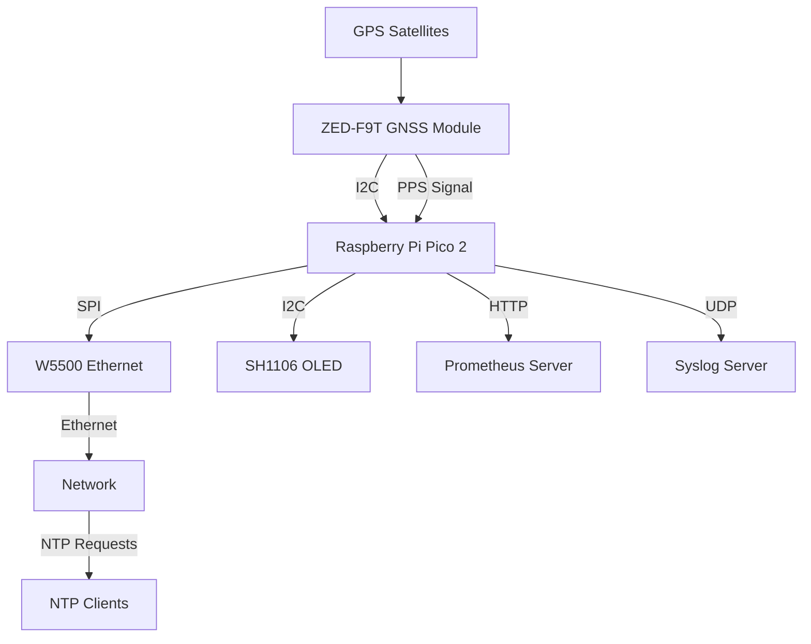
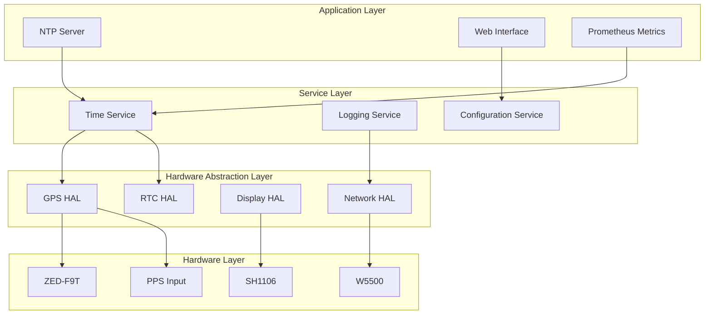

# GPS NTP Server Design Document

## Overview

このシステムは、Raspberry Pi Pico 2をベースとしたGPS同期NTPサーバーです。GPS受信機からのPPS（Pulse Per Second）信号を利用して高精度な時刻同期を実現し、イーサネット経由でNTPサービスを提供します。システムは以下の主要コンポーネントで構成されます：

- **Raspberry Pi Pico 2**: メインコントローラー（RP2350マイクロコントローラー）
- **SparkFun GNSS Timing Breakout ZED-F9T**: GPS/GNSS受信機とPPS信号生成
- **W5500**: イーサネット接続モジュール
- **SH1106 OLED**: 128x64ピクセルディスプレイ

## Architecture

### System Architecture



### Software Architecture



## Hardware Wiring Diagram

### Pin Connections

```
Raspberry Pi Pico 2 Pin Assignments:

GPIO Pins:
- GPIO 0 (I2C0 SDA)  → SH1106 SDA (OLED/RTC I2C bus)
- GPIO 1 (I2C0 SCL)  → SH1106 SCL (OLED/RTC I2C bus)
- GPIO 6 (I2C1 SDA)  → ZED-F9T SDA (GPS I2C bus)
- GPIO 7 (I2C1 SCL)  → ZED-F9T SCL (GPS I2C bus)
- GPIO 8             → PPS Input (ZED-F9T PPS)
- GPIO 3             → ZED-F9T SAFEBOOT (optional, for firmware updates)
- GPIO 4             → Status LED 1 (GNSS Fix Status) - Green
- GPIO 5             → Status LED 2 (Network Status) - Blue  
- GPIO 14            → Status LED 3 (Error Status) - Red
- GPIO 15            → Status LED 4 (PPS Status) - Yellow
- GPIO 16 (SPI0 RX)  → W5500 MISO
- GPIO 17 (SPI0 CSn) → W5500 CS
- GPIO 18 (SPI0 SCK) → W5500 SCLK
- GPIO 19 (SPI0 TX)  → W5500 MOSI
- GPIO 20            → W5500 RST
- GPIO 21            → W5500 INT

I2C Device Addresses:
- ZED-F9T GNSS Module: 0x42 (default u-blox address)
- SH1106 OLED Display: 0x3C (default OLED address)

Power Connections:
- 3V3 (OUT) → ZED-F9T VCC, SH1106 VCC, W5500 VCC, LED anodes (via current limiting resistors)
- GND       → All modules GND, LED cathodes
- VSYS      → External 5V power input (optional)

Status LEDs:
- LED1 (Green)  → GPIO 4 via 330Ω resistor (GNSS Fix Status)
- LED2 (Blue)   → GPIO 5 via 330Ω resistor (Network Status)  
- LED3 (Red)    → GPIO 14 via 330Ω resistor (Error Status)
- LED4 (Yellow) → GPIO 15 via 330Ω resistor (PPS Status)

GNSS Antenna:
- ZED-F9T ANT → External GNSS antenna (supports GPS L1/L2, GLONASS L1/L2, Galileo E1/E5b, BeiDou B1I/B2I, QZSS L1/L2)
- Active antenna recommended for QZSS L1S signal reception
```

### Physical Wiring Diagram

```
                    Raspberry Pi Pico 2
                   ┌─────────────────────┐
                   │                     │
    SH1106 ────────┤ GPIO 0 (SDA)        │ ← I2C0 Bus (OLED/RTC)
    RTC ───────────┤ GPIO 1 (SCL)        │   (4.7kΩ pull-up resistors)
    (I2C 0x3C/0x68)│                     │
                   │                     │
    ZED-F9T ───────┤ GPIO 6 (SDA)        │ ← I2C1 Bus (GPS)
    (I2C 0x42)     │ GPIO 7 (SCL)        │   (4.7kΩ pull-up resistors)
    PPS ───────────┤ GPIO 8              │
                   │                     │
    LED1 (Green)───┤ GPIO 4              │ ← GNSS Fix Status
    LED2 (Blue)────┤ GPIO 5              │ ← Network Status
    LED3 (Red)─────┤ GPIO 14             │ ← Error Status
    LED4 (Yellow)──┤ GPIO 15             │ ← PPS Status
                   │                     │
    W5500 ─────────┤ GPIO 16 (MISO)      │
    (SPI)          │ GPIO 17 (CS)        │
                   │ GPIO 18 (SCLK)      │
                   │ GPIO 19 (MOSI)      │
                   │ GPIO 20 (RST)       │
                   │ GPIO 21 (INT)       │
                   │                     │
    Power ─────────┤ 3V3, GND           │
                   └─────────────────────┘

Note: Both I2C buses require 4.7kΩ pull-up resistors on SDA and SCL lines
      I2C0 (GPIO 0/1): OLED Display and RTC
      I2C1 (GPIO 6/7): GPS Module  
      LEDs require 330Ω current limiting resistors
```

## Library Dependencies

### SparkFun u-blox GNSS Library
- **Version**: Latest stable version
- **Purpose**: u-blox ZED-F9T GNSS受信機との通信
- **Features**:
  - UBXプロトコル完全サポート
  - マルチコンステレーション対応（GPS, GLONASS, Galileo, BeiDou, QZSS）
  - 高精度時刻・位置情報取得
  - PPS信号同期
  - 設定管理とファームウェア更新
- **Key Classes**:
  - `SFE_UBLOX_GNSS`: メインGNSSクラス
  - `UBX_NAV_PVT_data_t`: 位置・速度・時刻データ構造
  - `UBX_NAV_SAT_data_t`: 衛星情報データ構造

### QZSS L1S Signal Processing
- **Purpose**: 準天頂衛星システム（QZSS）L1S信号の災害・危機管理通報サービス対応
- **Features**:
  - L1S信号受信と復調
  - 災害・危機管理通報（DC Report）デコード
  - 災害カテゴリ分類（地震、津波、火山、気象、その他）
  - 多言語メッセージ対応（日本語、英語）
- **Implementation**:
  - u-blox ZED-F9T のRXM-SFRBX メッセージ使用
  - L1S サブフレーム解析
  - JMA（気象庁）災害情報フォーマット準拠

## Components and Interfaces

### GPS Time Service
- **Purpose**: GPS/GNSS時刻取得とPPS信号処理（QZSS L1S信号対応）
- **Interfaces**: 
  - I2C通信でSparkFun u-blox GNSSライブラリ使用（アドレス0x42）
  - GPIO割り込みでPPS信号検出
  - 内部RTCとの時刻同期
- **Key Functions**:
  - SparkFun u-blox GNSSライブラリによるUBX プロトコル通信
  - GPS/GLONASS/Galileo/BeiDou/QZSS衛星システム対応
  - QZSS L1S信号受信と災害・危機管理通報サービス（DC Report）デコード
  - UBX-NAV-PVT メッセージによる高精度位置・時刻取得
  - PPS信号エッジ検出と時刻補正
  - 衛星信号品質監視（C/N0, 衛星数）
  - I2Cバス分離管理（Wire1使用でOLEDディスプレイとRTCから独立）
  - QZSS L1S災害情報の解析と表示

### NTP Server Service
- **Purpose**: NTPプロトコル実装とクライアント応答
- **Interfaces**:
  - UDP ポート123でNTP要求受信
  - 高精度タイムスタンプ生成
- **Key Functions**:
  - NTPv4プロトコル処理
  - Stratum レベル管理
  - クライアント要求統計収集

### Network Service
- **Purpose**: イーサネット接続とネットワーク通信
- **Interfaces**:
  - W5500 SPI通信
  - TCP/UDP ソケット管理
- **Key Functions**:
  - DHCP/静的IP設定
  - ソケット接続管理
  - ネットワーク状態監視

### Display Service
- **Purpose**: システム状態の視覚表示（QZSS災害情報含む）
- **Interfaces**:
  - I2C通信でSH1106制御
  - 画面レイアウト管理
- **Key Functions**:
  - 起動画面表示
  - リアルタイム状態更新（GPS/GLONASS/Galileo/BeiDou/QZSS衛星数）
  - エラー状態表示
  - QZSS L1S災害・危機管理通報の表示
  - 衛星コンステレーション別信号強度表示

### Configuration Service
- **Purpose**: システム設定管理
- **Interfaces**:
  - フラッシュメモリ読み書き
  - Web設定インターフェース
- **Key Functions**:
  - 設定ファイル管理
  - デフォルト設定適用
  - 設定検証

### Logging Service
- **Purpose**: ログ生成とSyslog転送
- **Interfaces**:
  - UDP Syslogプロトコル
  - ローカルログバッファ
- **Key Functions**:
  - 構造化ログ生成
  - Syslog RFC3164準拠
  - ログレベル管理

### Metrics Service
- **Purpose**: Prometheus監視メトリクス
- **Interfaces**:
  - HTTP /metrics エンドポイント
  - メトリクス収集API
- **Key Functions**:
  - NTP統計メトリクス
  - GPS精度メトリクス
  - システム状態メトリクス

## Data Models

### Time Data Structure
```c
typedef struct {
    uint64_t unix_timestamp;    // Unix timestamp (seconds)
    uint32_t nanoseconds;       // Nanosecond precision
    uint8_t  stratum;          // NTP stratum level
    bool     gps_synchronized; // GPS sync status
    float    precision;        // Time precision (seconds)
} time_data_t;
```

### GPS Status Structure
```c
typedef struct {
    bool     fix_valid;        // GPS fix validity
    uint8_t  satellites_gps;   // Number of GPS satellites
    uint8_t  satellites_glonass; // Number of GLONASS satellites
    uint8_t  satellites_galileo; // Number of Galileo satellites
    uint8_t  satellites_beidou;  // Number of BeiDou satellites
    uint8_t  satellites_qzss;    // Number of QZSS satellites
    float    hdop;            // Horizontal dilution of precision
    float    vdop;            // Vertical dilution of precision
    uint32_t last_pps_time;   // Last PPS timestamp
    bool     pps_active;      // PPS signal status
    uint8_t  fix_type;        // Fix type (0=no fix, 1=dead reckoning, 2=2D, 3=3D, 4=GNSS+dead reckoning, 5=time only)
    uint32_t time_accuracy;   // Time accuracy estimate (nanoseconds)
} gnss_status_t;
```

### QZSS L1S Data Structure
```c
typedef struct {
    bool     l1s_signal_detected; // QZSS L1S signal presence
    uint8_t  disaster_category;   // Disaster category code
    uint8_t  disaster_sub_category; // Disaster sub-category
    char     disaster_message[256]; // Disaster message text
    uint32_t message_timestamp;   // Message timestamp
    bool     message_valid;       // Message validity flag
    uint8_t  signal_strength;     // L1S signal strength
} qzss_l1s_data_t;
```

### NTP Statistics Structure
```c
typedef struct {
    uint32_t requests_total;   // Total NTP requests
    uint32_t requests_per_sec; // Current request rate
    float    avg_response_time; // Average response time
    uint32_t clients_active;   // Active client count
} ntp_stats_t;
```

### Configuration Structure
```c
typedef struct {
    char     hostname[32];     // Device hostname
    uint32_t ip_address;       // Static IP (0 for DHCP)
    uint32_t netmask;         // Network mask
    uint32_t gateway;         // Default gateway
    char     syslog_server[64]; // Syslog server address
    uint16_t syslog_port;     // Syslog port
    uint8_t  log_level;       // Logging level
    bool     prometheus_enabled; // Prometheus metrics
    
    // GNSS Configuration
    bool     gps_enabled;      // GPS constellation enable
    bool     glonass_enabled;  // GLONASS constellation enable
    bool     galileo_enabled;  // Galileo constellation enable
    bool     beidou_enabled;   // BeiDou constellation enable
    bool     qzss_enabled;     // QZSS constellation enable
    bool     qzss_l1s_enabled; // QZSS L1S disaster alert enable
    uint8_t  gnss_update_rate; // GNSS update rate (Hz)
    uint8_t  disaster_alert_priority; // Disaster alert display priority
} config_t;
```

## Error Handling

### GNSS Signal Loss
- **Detection**: PPS信号の30秒間欠如、または全コンステレーション信号喪失
- **Response**: 内部RTCにフォールバック、Stratum レベル上昇、最後に受信した衛星システムの記録
- **Recovery**: GNSS信号復旧時の自動再同期、マルチコンステレーション優先順位による復旧

### QZSS L1S Signal Processing Errors
- **Detection**: L1S信号復調エラー、災害メッセージCRCエラー
- **Response**: エラーログ出力、前回有効メッセージの保持
- **Recovery**: 信号品質改善時の自動復旧、災害情報の再取得

### Network Disconnection
- **Detection**: W5500リンク状態監視
- **Response**: 再接続試行、ローカルログバッファリング
- **Recovery**: 接続復旧時のバッファ送信

### Hardware Failures
- **Detection**: 通信タイムアウト、異常応答
- **Response**: エラー状態表示、セーフモード移行
- **Recovery**: ハードウェアリセット、設定復旧

### Memory Management
- **Prevention**: 静的メモリ割り当て、スタック監視
- **Detection**: メモリ使用量監視
- **Response**: 非必須機能停止、ログ出力制限

## Testing Strategy

### Unit Testing
- **GNSS Parser**: UBX メッセージパース機能（SparkFun u-blox GNSSライブラリ）
- **QZSS L1S Decoder**: L1S災害・危機管理通報メッセージデコード
- **NTP Protocol**: NTPパケット生成・解析
- **Time Calculations**: 時刻変換・精度計算
- **Configuration**: 設定検証・永続化

### Integration Testing
- **Hardware Communication**: 各モジュールとの通信
- **GNSS Multi-constellation**: GPS/GLONASS/Galileo/BeiDou/QZSS同時受信
- **Network Stack**: TCP/UDP通信機能
- **Time Synchronization**: GNSS-PPS-RTC同期
- **Display Updates**: 状態表示の正確性（QZSS災害情報含む）
- **QZSS L1S Reception**: L1S信号受信と災害情報デコード

### System Testing
- **NTP Client Compatibility**: 各種NTPクライアントとの互換性
- **Long-term Stability**: 長時間動作での精度維持（マルチGNSS環境）
- **Load Testing**: 複数クライアント同時接続
- **Failover Testing**: GNSS信号喪失時の動作
- **QZSS L1S Disaster Alert**: 災害情報受信時の適切な表示・通知
- **Multi-constellation Performance**: 各衛星システムの性能比較

### Performance Testing
- **Response Time**: NTP応答時間測定
- **Accuracy**: GNSS時刻との差分測定（マルチコンステレーション）
- **Resource Usage**: CPU・メモリ使用率（SparkFun u-blox GNSSライブラリ使用時）
- **Network Throughput**: パケット処理性能
- **QZSS L1S Processing**: L1S信号処理による性能影響測定

## Security Considerations

### Network Security
- **Access Control**: 設定可能なクライアントIP制限
- **Rate Limiting**: DDoS攻撃対策
- **Secure Configuration**: デフォルトパスワード変更

### Data Integrity
- **Configuration Validation**: 不正設定値の検証
- **Time Validation**: 異常時刻値の検出
- **Log Integrity**: ログ改ざん防止

### Physical Security
- **Debug Interface**: 本番環境でのデバッグ無効化
- **Firmware Protection**: 不正ファームウェア対策
- **Tamper Detection**: 物理的改ざん検出